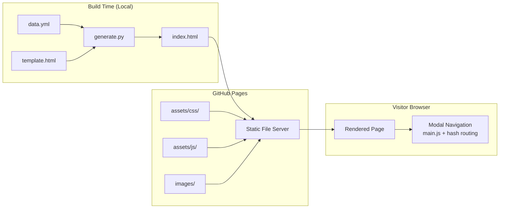

# Design Document

## Personal Portfolio Website — Kiran Thakur

---

## Overview

This design describes the technical implementation of a personal portfolio website for Kiran Thakur, a Senior Software Developer and Data Scientist with 6 years of experience. The site is built on top of the existing HTML5 UP "Dimension" template — a one-page, modal-based layout — and hosted as a static site on GitHub Pages.

The core architectural decision is a **Python static site generator** (`generate.py`) that reads structured resume data from a YAML file (`data.yml`) and renders the final `index.html` using a Jinja2 template (`template.html`). This separates content from presentation: updating the portfolio requires only editing `data.yml`, not touching HTML.

The existing workspace already contains all CSS, JavaScript, image, and font assets from the Dimension template. The generator only needs to produce `index.html`; all other assets are already in place.

### Key Design Decisions

- **YAML over JSON for data file**: YAML is more human-readable and easier to maintain for resume-style content with multi-line strings and nested lists.
- **Jinja2 for templating**: Jinja2 is the de-facto standard for Python HTML templating, has excellent documentation, and requires no additional runtime beyond `pip install jinja2`.
- **No build step for CSS/JS**: The Dimension template ships pre-compiled CSS. There is no need for a SASS build step in the generation pipeline; the existing `assets/css/main.css` is used directly.
- **Hash-based modal routing**: The Dimension template's `main.js` already implements hash-based navigation (`#about`, `#experience`, etc.) with no modifications needed.
- **No contact form**: The contact section will display static contact information (email, phone, GitHub) rather than a form, avoiding the need for any server-side form handler.

---

## Architecture

The system has two distinct phases:

**Build time** (developer's machine):
```
data.yml  ──►  generate.py  ──►  index.html
                    │
              template.html
```

**Runtime** (visitor's browser):
```
GitHub Pages (static file server)
    │
    ├── index.html        (generated)
    ├── assets/css/       (pre-existing)
    ├── assets/js/        (pre-existing)
    ├── assets/webfonts/  (pre-existing)
    └── images/           (pre-existing)
```



### Generation Pipeline

1. `generate.py` is invoked from the command line.
2. It loads and validates `data.yml` against a required-field schema.
3. If validation fails, it prints a descriptive error and exits with code 1.
4. If validation passes, it loads `template.html` via Jinja2's `FileSystemLoader`.
5. It renders the template with the data context and writes the result to `index.html`.
6. The entire process completes in well under 5 seconds (Jinja2 rendering of a single page is typically < 100ms).

---

## Components and Interfaces

### 1. `data.yml` — Content Data File

The single source of truth for all portfolio content. Top-level keys:

| Key | Type | Description |
|---|---|---|
| `personal` | object | Name, title, bio, location, resume PDF path |
| `experience` | list | Work history entries (reverse-chronological) |
| `skills` | list | Skill category objects |
| `education` | list | Education entries (reverse-chronological) |
| `contact` | object | Email, phone, GitHub URL |

### 2. `generate.py` — Static Site Generator

**Interface**: Command-line script, no arguments required (reads `data.yml` and `template.html` from the same directory, writes `index.html` to the same directory).

**Responsibilities**:
- Load and parse `data.yml` using PyYAML
- Validate presence of all required top-level keys
- Load `template.html` using Jinja2 `FileSystemLoader`
- Render template with data context
- Write rendered HTML to `index.html`
- Exit with code 0 on success, code 1 on validation or rendering error

**Error handling**: Any missing required field triggers a `sys.exit(1)` with a message of the form:
```
Error: Missing required field in data.yml: '<field_name>'
```

### 3. `template.html` — Jinja2 HTML Template

Derived from the HTML5 UP Dimension `index.html`. All static content is replaced with Jinja2 template variables and loops. The template structure mirrors the Dimension layout:

- `<head>` — title, meta tags, CSS links (relative paths)
- `#bg` — background div (unchanged from template)
- `#wrapper` — outer flex container
  - `#header` — hero section with name, title, nav links
  - `#main` — container for all modal articles
    - `#about` article
    - `#experience` article
    - `#skills` article
    - `#education` article
    - `#contact` article
  - `#footer` — attribution credit
- JS script tags (relative paths)

### 4. Static Assets (pre-existing, unmodified)

| Path | Purpose |
|---|---|
| `assets/css/main.css` | Dimension theme styles |
| `assets/css/fontawesome-all.min.css` | FontAwesome icons |
| `assets/css/noscript.css` | No-JS fallback styles |
| `assets/js/main.js` | Modal/hash routing logic |
| `assets/js/jquery.min.js` | jQuery dependency |
| `assets/js/breakpoints.min.js` | Responsive breakpoints |
| `assets/js/browser.min.js` | Browser detection |
| `assets/js/util.js` | Utility functions |
| `assets/webfonts/` | FontAwesome web fonts |
| `images/bg.jpg` | Background image |
| `images/overlay.png` | Overlay texture |

---

## Data Models

### `personal` object

```yaml
personal:
  name: "Kiran Thakur"
  title: "Senior Software Developer | Data Scientist"
  bio: "..."          # Multi-line professional summary
  location: "Pune, Maharashtra, India"
  resume_pdf: "Kiran Thakur Resume.pdf"
  github: "https://github.com/<username>"
```

### `experience` list entry

```yaml
experience:
  - company: "Infinite Computer Solutions"
    title: "Senior Software Developer"
    period: "Feb 2025 – Present"
    responsibilities:
      - "..."
    technologies:
      - "AWS Lambda"
      - "Django"
```

Entries are listed in reverse-chronological order in `data.yml` (most recent first). The template renders them in the order they appear in the list.

### `skills` list entry

```yaml
skills:
  - category: "Languages"
    items:
      - "Python"
  - category: "Cloud"
    items:
      - "AWS (S3, DynamoDB, Lambda, CloudWatch)"
```

### `education` list entry

```yaml
education:
  - institution: "BITS Pilani"
    degree: "Masters in Data Science and Engineering"
    year: "Pursuing"
    result: "CGPA: 6"
  - institution: "CDAC Chennai"
    degree: "PG Diploma in Big Data Analytics"
    year: "2018–19"
    result: "70%"
```

Entries are listed in reverse-chronological order in `data.yml`.

### `contact` object

```yaml
contact:
  email: "kiranthakur1001@gmail.com"
  phone: "+91 8888012961"
  github: "https://github.com/<username>"
```

### Required Field Schema

The generator validates the following required fields before rendering:

| Field path | Type | Required |
|---|---|---|
| `personal` | object | Yes |
| `personal.name` | string | Yes |
| `personal.title` | string | Yes |
| `personal.bio` | string | Yes |
| `personal.location` | string | Yes |
| `personal.resume_pdf` | string | Yes |
| `experience` | list | Yes |
| `skills` | list | Yes |
| `education` | list | Yes |
| `contact` | object | Yes |
| `contact.email` | string | Yes |
| `contact.phone` | string | Yes |
| `contact.github` | string | Yes |

---

## Correctness Properties

*A property is a characteristic or behavior that should hold true across all valid executions of a system — essentially, a formal statement about what the system should do. Properties serve as the bridge between human-readable specifications and machine-verifiable correctness guarantees.*

### Property 1: Reverse-Chronological Ordering

*For any* `data.yml` containing a list of experience or education entries with associated date/period fields, the rendered `index.html` SHALL present those entries in the same order they appear in the data list — meaning the data file itself is the authoritative ordering source, and the generator must not reorder entries.

**Validates: Requirements 3.1, 5.1**

### Property 2: Experience Entry Completeness

*For any* experience entry in the data file containing `company`, `title`, `period`, `responsibilities`, and `technologies` fields, the rendered HTML SHALL include all five fields for that entry — no field may be silently dropped or omitted.

**Validates: Requirements 3.2, 3.4**

### Property 3: Education Entry Completeness

*For any* education entry in the data file containing `institution`, `degree`, `year`, and `result` fields, the rendered HTML SHALL include all four fields for that entry.

**Validates: Requirements 5.2**

### Property 4: Valid Data Produces Valid HTML

*For any* `data.yml` that satisfies the required field schema, the generator SHALL produce an `index.html` that is well-formed HTML containing the five expected section articles (`#about`, `#experience`, `#skills`, `#education`, `#contact`).

**Validates: Requirements 7.2**

### Property 5: Missing Required Field Causes Descriptive Error

*For any* `data.yml` that is missing any single required top-level key (`personal`, `experience`, `skills`, `education`, `contact`), the generator SHALL exit with a non-zero status code and print an error message that names the missing field.

**Validates: Requirements 7.3**

### Property 6: Generator Idempotence

*For any* valid `data.yml`, running `generate.py` twice in succession on the same data file SHALL produce byte-identical `index.html` output on both runs.

**Validates: Requirements 7.7**

### Property 7: All Asset Paths Are Relative

*For any* generated `index.html`, every `src` and `href` attribute referencing a local asset (CSS, JS, image, font) SHALL use a relative path — no absolute URLs (`http://`, `https://`, or paths starting with `/`) for local assets.

**Validates: Requirements 8.3, 8.4**

### Property 8: All Images Have Non-Empty Alt Attributes

*For any* generated `index.html`, every `` element SHALL have a non-empty `alt` attribute.

**Validates: Requirements 9.1**

---

## Error Handling

### Generator Errors

| Scenario | Behavior |
|---|---|
| `data.yml` not found | Print `Error: data.yml not found.` and exit 1 |
| `data.yml` is not valid YAML | Print `Error: data.yml is not valid YAML: <parse error>` and exit 1 |
| Required field missing | Print `Error: Missing required field in data.yml: '<field>'` and exit 1 |
| `template.html` not found | Print `Error: template.html not found.` and exit 1 |
| Jinja2 rendering error | Print `Error: Template rendering failed: <error>` and exit 1 |
| Success | Write `index.html`, print `Generated index.html successfully.` and exit 0 |

### Runtime (Browser) Error Handling

- **JavaScript disabled**: The `noscript.css` stylesheet (already present) hides the modal-based layout and shows a fallback message, per the Dimension template's built-in noscript support.
- **Missing assets**: Since all assets are relative and co-located, missing assets would only occur if files were deleted from the repository. No special handling is needed beyond standard 404 behavior.
- **PDF not found**: The resume download link will result in a 404 if the PDF file is not committed to the repository. The generator does not validate that the PDF file exists — this is a deployment concern.

---

## Testing Strategy

### Overview

The testing strategy uses a **dual approach**:
- **Unit/example tests**: Verify specific content, structure, and error conditions with concrete inputs.
- **Property-based tests**: Verify universal properties across many randomly generated inputs.

Property-based testing is appropriate here because the generator is a pure function (data → HTML) with a large input space (any valid YAML structure), and several universal properties must hold for all valid inputs.

### Property-Based Testing Library

**Library**: [`hypothesis`](https://hypothesis.readthedocs.io/) (Python)
**Minimum iterations**: 100 per property test (Hypothesis default `max_examples=100`)

Each property test is tagged with a comment referencing the design property:
```python
# Feature: personal-portfolio-website, Property N: <property_text>
```

### Property Tests

Each of the 8 correctness properties maps to one Hypothesis property test:

| Property | Test description |
|---|---|
| P1: Ordering preserved | Generate lists of experience/education entries in known order; verify rendered HTML preserves that order |
| P2: Experience completeness | Generate random experience entries with all required fields; verify all fields appear in rendered HTML |
| P3: Education completeness | Generate random education entries with all required fields; verify all fields appear in rendered HTML |
| P4: Valid data → valid HTML | Generate random valid data dicts; run generator; parse output with `html.parser`; verify five section articles present |
| P5: Missing field → error | For each required field, generate a valid data dict then remove that field; verify exit code 1 and field name in stderr |
| P6: Idempotence | Generate random valid data dicts; run generator twice; compare outputs byte-for-byte |
| P7: Relative asset paths | Generate valid data; render; parse all `src`/`href` attributes; assert none start with `http`, `https`, or `/` for local assets |
| P8: Alt attributes | Generate valid data with varying image references; render; parse all `` tags; assert all have non-empty `alt` |

### Unit / Example Tests

- Generator produces `index.html` from the actual `data.yml` (smoke test)
- Rendered HTML contains "Kiran Thakur" as primary heading
- Rendered HTML contains all five nav links
- Rendered HTML contains all four employer names
- Rendered HTML contains all four education entries
- Rendered HTML contains `mailto:kiranthakur1001@gmail.com`
- Rendered HTML contains GitHub link with `target="_blank"`
- Rendered HTML contains semantic elements: `<header>`, `<main>`, `<section>`, `<nav>`, `<footer>`
- Rendered HTML contains attribution credit for HTML5 UP
- Generator completes within 5 seconds

### Accessibility Testing

WCAG 2.1 AA compliance (colour contrast, keyboard navigation, mobile viewport) requires manual testing with assistive technologies and browser-based tools (axe DevTools, Lighthouse). These are not automated in the test suite but should be verified before deployment.

### Test File Structure

```
tests/
├── test_generator.py        # Unit and property tests for generate.py
├── conftest.py              # Shared fixtures (sample data, temp dirs)
└── fixtures/
    ├── valid_data.yml       # Minimal valid data file for smoke tests
    └── missing_field_*.yml  # Data files with each required field removed
```
